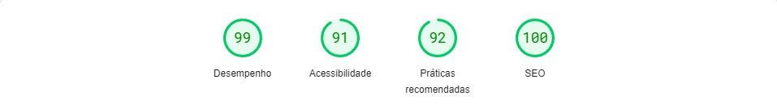
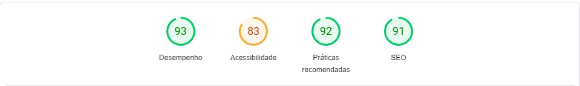
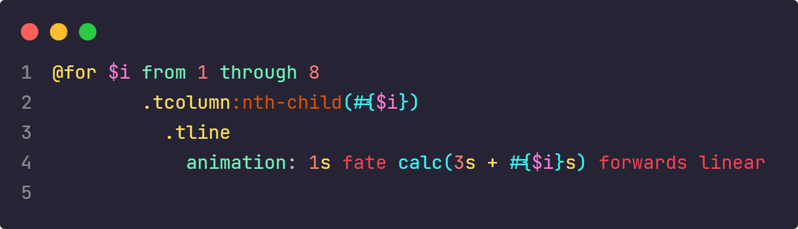
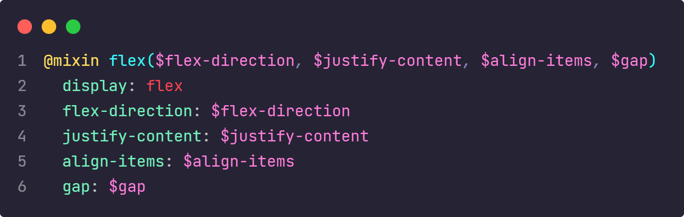

<h1 align="center">Titulo</h1>

  
  
  

<a href="https://gustav0dedeus.github.io/BoraCode-8/">um gif do projeto</a>

## Documentação
  - <a href="#projeto">Projeto</a>
  - <a href="#diario"> Diário de bordo </a>
  - <a href="#estrutura"> Estrutura do Projeto</a>
    - <a href="#stacks"> Stacks</a>
    - <a href="#stacks"> Cores</a>
    - <a href="#wakatime"> Distribuição do Tempo</a>
    - <a href="#page"> PageSpeed Insights</a>
  - <a href="#melhorias"> Melhorias</a>
  - <a href="#destaque">Destaque para alguns códigos</a>

<h2 id="projeto"> Projeto </h2>

> descrição <a href="" >Link para o site</a>

<h2 id="diario"> Diário de bordo </h2>
<table>
  <thead>
        <tr>
            <th align="center">
                 
                

                    <small>DATA</small>
                

            </th>
            <th align="center">
                 
                
 
                    <small>
                        TAREFA
                    </small>
                

            </th>
            <th align="left">
                
                
 
                    <small>
                     TEMPO
                    </small>
                

            </th>
            <th align="center">
                
                
 
                    <small>
                      COMMITS
                    </small>
                

            </th>
        </tr>
    </thead>
    <tbody>
        <tr>
            <td>23/02</td>
            <td><a href="#estrutura">Estruturação do projeto</a></td>
            <td>16m</td>
            <td align="center">
            <a href="#commits">0</a></td>
        </tr>
    </tbody>
</table>

<h2 id="estrutura"> Estrutura do Projeto </h2>

> Nessa seção específico detalhes sobre o desenvolvimento do projeto

<h3 id="stacks"> Stacks utilizadas </h3>
  <strong>Font awesome,<strong>
  <strong>Gsap,  <strong>
  <strong>Google Fonts,<strong>
  <strong>Figma,<strong>
  <strong>Wakatime<strong>
  
<h3 id="cores">Cores do Projeto</h3>

| Cor               | Hexadecimal                                                |
| ----------------- | ---------------------------------------------------------------- |
| Neutral White      |  #fff |

<h3 id="wakatime">Tempo distribuido em arquivos </h3>

| # | Tempo         | Arquivo                                            |
|--| ----------------- | ---------------------------------------------------------------- |
| # | 2 hrs 52 mins | assets/sass/_components.sass |

<h3 id="page">PageSpeed Insights</h3>
Dados do computador 
 
Avalização para dispositivos movéis 

<h2 id="melhorias"> Melhorias ao Projeto</h2>

- Acrecentar funcionalidades a dashboard
- Desenvolver um aplicativo para esse sistema
- Integrar usuários a plataforma

<h2 id="destaque">Destaque para alguns códigos</h2>

## Licença

[MIT](./LICENSE)

  